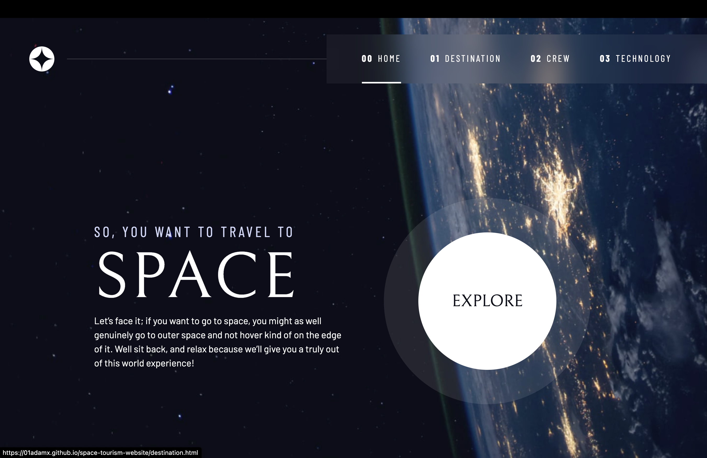

# Space tourism website solution

This is a solution to the [Space tourism website challenge on Frontend Mentor](https://www.frontendmentor.io/challenges/space-tourism-multipage-website-gRWj1URZ3).

## Table of contents

- [Overview](#overview)
  - [The challenge](#the-challenge)
  - [Screenshot](#screenshot)
  - [Links](#links)
  - [Built with](#built-with)
- [Author](#author)

## Overview

### The challenge

Users should be able to:

- View the optimal layout for each of the website's pages depending on their device's screen size
- See hover states for all interactive elements on the page
- View each page and be able to toggle between the tabs to see new information

### Screenshot

### Links

- Solution URL: [Solution URL on Github](https://github.com/01adamx/space-tourism-website)
- Live Site URL: [Live site URL](https://01adamx.github.io/space-tourism-website/)

### Built with

- Semantic HTML5 markup
- CSS custom properties
- Flexbox
- CSS Grid
- Mobile-first workflow
- Javascript

## Author

- Github - [01adamx](hhttps://github.com/01adamx)
- Twitter - [@techieadamx](https://x.com/TechieAdamx)
- Frontend Mentor - [@01adamx](https://www.frontendmentor.io/profile/01adamx)